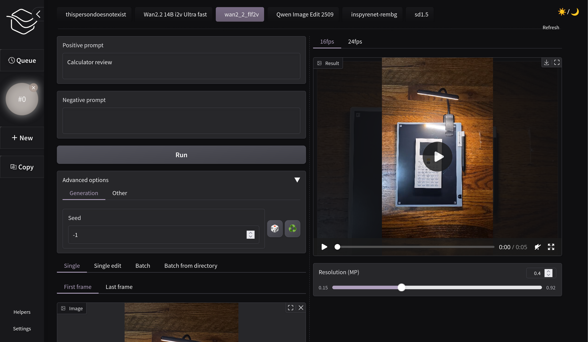

# (Beta) Minimalistic Comfy Wrapper WebUI

An alternative additional non-node based UI for [ComfyUI](https://github.com/comfyanonymous/ComfyUI), that dynamically adapts to your workflows - you only need to change the titles of nodes that you want to see in the Minimalistic webui, and click "Refresh" button

You have working workflows inside your ComfyUI installation, but you would want to work with them from a different perspective with all the noodles hidden? You find SwarmUI or ViewComfy too overengineered? So this project is made for you

## Key features:
1. Stability: you don't need to be afraid of refreshing/closing the page - everything you do is kept in browser's local storage (like in ComfyUI). It only resets on the project updates to prevent unstable behavior
1. Work in Comfy and in this webui with the same workflows: you don't need to copy anything or to export in api format. Edit your workflows in Comfy - press "Refresh" button, and see the changes in MCWW
1. Better queues: you can change the order of tasks, pause/resume the queue, and don't worry closing Comfy / rebooting your PC during generations (Coming soon)
1. Prompt presets (Coming soon): save your favorite prompts in presets next to the input fields, and retrieve them in 1 click

Don't hesitate to report any issues

## Installation

The easiest way to use this webui - install it as ComfyUI extension. To do it:
1. Activate ComfyUI python environment in command line `. .env/bin/activate` on Linux or `call .env\Scripts\activate.bat` in Windows from the root of your ComfyUI installation
1. Clone this repository into `custom_nodes/` directory inside your ComfyUI installation: `git clone https://github.com/light-and-ray/Minimalistic-Comfy-Wrapper-WebUI custom_nodes/Minimalistic-Comfy-Wrapper-WebUI`
1. Install requirements `pip install -r custom_nodes/Minimalistic-Comfy-Wrapper-WebUI/requirements.txt`

If everything is fine, you should see this button inside ComfyUI:

Alternately you can run this webui as a standalone server:
1. Clone this repo somewhere you like
1. Use `.env.example` to create your own `.env` file
1. Create python virtual environment `python -m venv venv`
1. Activate this environment `. venv/bin/activate` in Linux or `call venv\Scripts\activate.bat` in Windows
1. Install requirements `pip install -r requirements.txt`
1. Use `python -m mcww.standalone` to start the server inside the environment, or use `standalone-start.sh` in Linux or `standalone-start.cmd` in Windows scripts that activate the environment and start the server automatically

## Roadmap to the Release version
- Video support
- Keep queue on a disk
- Add prompt templates
- Add webui settings
- Add progress bar
